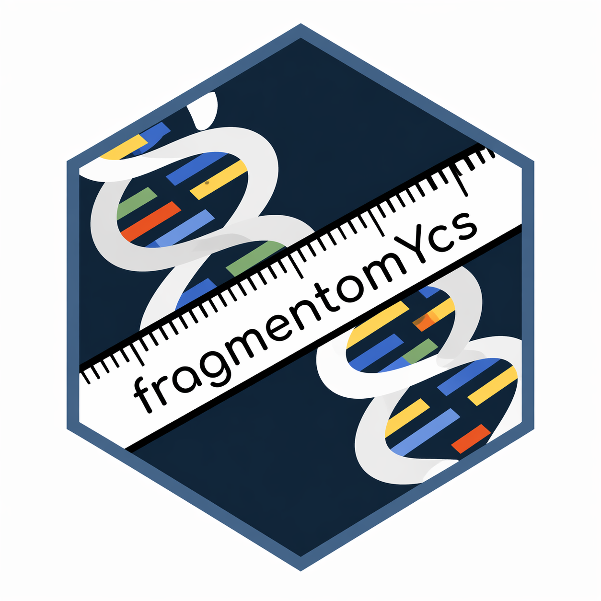

# fragmentomYcs 

This repository provides a Python port of the R package [fRagmentomics](https://github.com/ElsaB-Lab/fRagmentomics).

The purpose is twofold:

- To use fRagmentomics functionality in a Python environment, without relying on `rpy2`.
- To use fRagmentomics in a Windows environment, without requiring `bcftools` or `pysam`.

## Example

To give it a try, run the following example script:

- [`examples/scripts/example_01_basic_usage.py`](examples/scripts/example_01_basic_usage.py): runs the basic `fragmentomYcs` workflow and displays fragment-length histograms.
